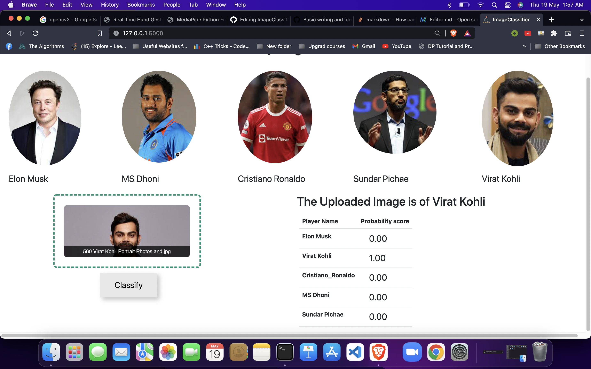

# ImageClassifier
It is a simple Deep Learning project where i created a Machine Learning model which after training able to detect the faces of 5 celebrity named [ Elon Musk , Virat Kohli, MS Dhoni, Sundar Pichae, Cristiano Ronaldo]
Before making prediction it look for the faces in the image uploaded , if the face is recognizable especially both the eyes in the image , then model will make the prediction of the celebrity present in that image among the 5 celebrity named above

###UI of the project

you can **Drag Drop or Upload ** image on the upload section and click classify , the model will classify the celebrity in the image and will predict the celebrity with a probability that model says the image belongs to this celebrity with x prediction probability , celebrity having the maximum probability score wins 

####Sample

